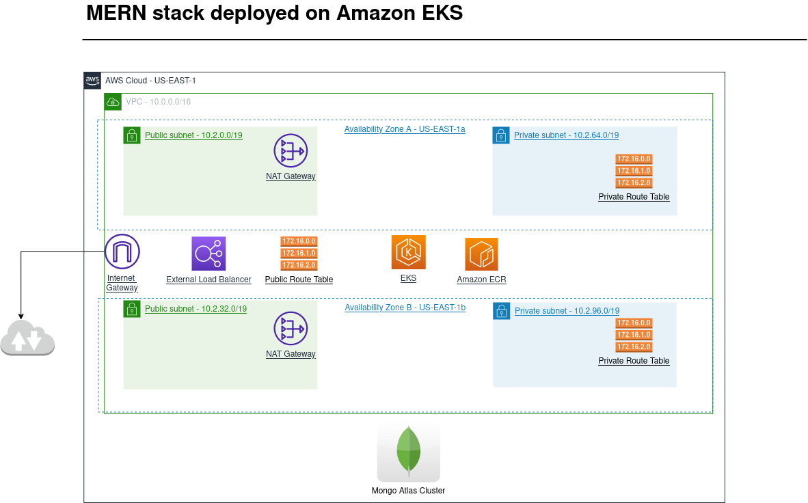

# AWS Final Project

## Introduction
This is a project for the AWS Program from Applaudo Studios.
The goal of this project is to create a solution that includes a front-end, a back-end and a MongoDB databases running in an EKS Cluster.

## Description
The solution consist of an infraestructure built on terraform that has two availability zones, each one with a public and a private subnet. The public subnets have a NAT Gateway, the private subnets have an EKS Cluster with a Node Group and a MongoDB database. The application is deployed from an ECR repository.


## Deployment
The application is deployed in AWS using the following services:
- Amazon EKS
- Nat Gateway
- Load Balancer
- VPC
- ECR
- Route tables
- Security Groups


The ECR service is deployed using Github Actions from the repository where the application lives, and the MongoDB database is deployed manually using Atlas.

## How to run the infrastructure
1. Clone the repository
2. Install Terraform
3. Install AWS CLI
4. Configure AWS CLI
5. Run the following commands:
```
terraform init
terraform workspace new prod
terraform plan
terraform apply -auto-approve
```

## How to run the application

You can copy the code from the repository and run it locally using the following command:
```
git clone https://github.com/Walter-Gaitan/devops-final-project-app.git
```

You can learn more about how to use it in the documentation of the repository.

## How to run the MongoDB database

You can [create a MongoDB database using Atlas](https://www.mongodb.com/basics/create-database) and connect it to the application.

## Destroy the infrastructure

Before destroying the infrastructure, you need to delete the load balancers and kubeconfig file. Once you have done that, you can run the following command:
```
terraform destroy -auto-approve
```